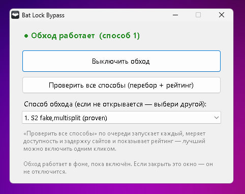

# Bat Lock Bypass

DPI bypass for Windows: SoundCloud, YouTube, Discord and other services.
A graphical shell over a packet-interception engine with a set of ready-made
bypass presets and automatic picking of the best one.



## Features

- One click turns the bypass on; it keeps working in the background (the window can be closed)
- 26 preinstalled presets: `fake`, `multisplit`, `hostfakesplit`, `fakedsplit`,
  `multidisorder` and their combinations
- The «Check all ways» button applies every preset in turn, measures the
  reachability and latency of the target sites and shows a rating — the best
  one can be enabled with a single click
- Domain list `lists/hosts.txt` — easy to add your own sites
- Console mode with the main controls

## Run

Requires Windows 10/11 and administrator rights (needed by the packet-capture
driver). Run `Bat Lock Bypass.exe` — the bypass turns on automatically.
If a site does not open, choose another preset in the list or run
«Check all ways».

Console:

```powershell
powershell -ExecutionPolicy Bypass -File console.ps1                 # interactive menu
powershell -ExecutionPolicy Bypass -File console.ps1 -Preset 16      # specific preset
powershell -ExecutionPolicy Bypass -File console.ps1 -Status         # is the bypass running
powershell -ExecutionPolicy Bypass -File console.ps1 -Stop           # stop the bypass
```

## Build

- `tools/build_gui.bat` — builds the GUI from the `src/BatLockBypass.cs` source
  (uses the .NET Framework compiler built into Windows)
- `tools/brand_engine.ps1` — applies the icon and metadata to the engine
  in `bin/` (uses rcedit)

More details in [docs/](docs/BUILD.md): building, usage, presets and host lists.

## Third-party components

- [WinDivert](https://reqrypt.org/windivert.html) — packet interception and
  modification (LGPL/GPL)
- Cygwin (`cygwin1.dll`) — engine runtime (LGPL)

## Disclaimer

The project is meant to restore access to legitimate services.
Use it in accordance with the laws of your country.
